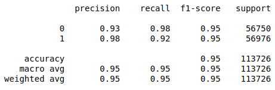

# Credit Card Fraud Detection

### Problem statement:
Identify fraud transactions so that financial organizations can prevent those transaction from happening. 

### Type of Data-mining task:
Our data is labeled as ‘0’ meaning valid transaction and ‘1’ meaning fraud transaction. It is a Supervised learning (classification) task.

### Data-set and brief overview:
The data-set contain transactions made with credit cards. This data-set presents transactions, where we have 492 frauds out of 284,315 transactions. It has 30 input features and 1 target variable. The data-set is highly unbalanced, the positive class (frauds) account for 0.173% of all transactions.

The data-set is publicly available at https://www.kaggle.com/mlg-ulb/creditcardfraud/home

Due to confidentiality issues, Kaggle doesn’t provide the background information about the features except ‘Time’ and ‘Amount’. ‘Time’ contains the seconds elapsed between each transaction and the first transaction in the data-set. The feature ‘Amount’ is the Transaction Amount. ‘Class’ is the target variable and it is 1 in case of fraud and 0 otherwise.

### Results of our model:
Using Logistic regression on balanced data-set (oversampled)

### Methodology:

Here, we will go through the following steps:

    1. Reading and exploring data to check
        a. variable (field) data types
        b. duplicates
        c. missing values
        d. correlation among features
        e. balance in target class
        f. distribution and scale of features
                  
    2. Data pre-processing: 
        a. normalization (Standard scaling). 
        b. dropping fields
        c. balancing target class (oversampling)
        d. creating data-sets for analysis (train test split)
           
    3. Model building, training and testing  

### Performance evaluation:
    Accuracy, precision and recall, and f1-score

### Requirements:
    Python 3.8, (Jupyter Notebook), pandas-1.1.1, numpy-1.19.1, scipy-1.5.2, scikit-learn-0.23.2, matplotlib-3.3.1, seaborn-0.10.1, imbalanced-learn

### Resources that were helpful:
[Muhammad Rizwan](https://engmrk.com/module-19-credit-card-fraud-detection/?utm_campaign=News&utm_medium=Community&utm_source=DataCamp.com
)

[Christos Mousmoulas](https://towardsdatascience.com/credit-card-fraud-detection-1b3b3b44109b)

_License MIT_
